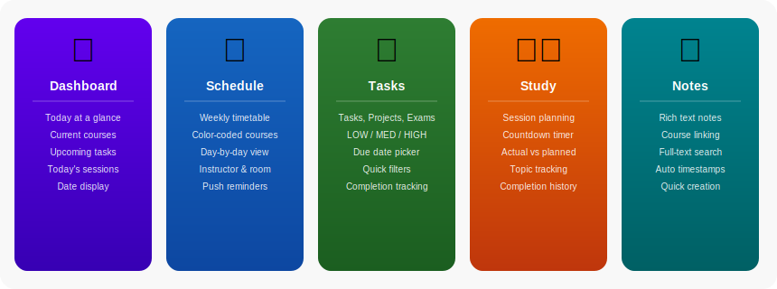

<div align="center">


# StudyRhythmo

**Your personal Android study companion**

[](https://developer.android.com)
[](https://kotlinlang.org)
[-blue?style=for-the-badge)](https://developer.android.com/about/versions/oreo)
[-4CAF50?style=for-the-badge)](https://developer.android.com/about/versions/14)
[](LICENSE)
[](https://github.com/kabaediz/StudyRhythmo/releases)

</div>

---

## 📖 Inhaltsverzeichnis

- [Über die App](#-über-die-app)
- [Features im Überblick](#-features-im-überblick)
- [Screenshots](#-screenshots)
- [Architektur](#-architektur)
- [Tech-Stack](#-tech-stack)
- [Systemvoraussetzungen](#-systemvoraussetzungen)
- [Installation & Build](#-installation--build)
- [Projektstruktur](#-projektstruktur)
- [Features im Detail](#-features-im-detail)
- [Datenbank-Schema](#-datenbank-schema)
- [Benachrichtigungen](#-benachrichtigungen)
- [Mitmachen](#-mitmachen)

---

## 🎓 Über die App

**StudyRhythmo** ist eine native Android-App, die Studierenden und Schüler:innen hilft, ihren Lernalltag strukturiert zu organisieren. Die App vereint Stundenplan, Aufgabenverwaltung, Lernzeiterfassung und Notizen in einer übersichtlichen, intuitiven Oberfläche.

Mit StudyRhythmo behältst du immer den Überblick:
- **Wann** hast du welche Lehrveranstaltung?
- **Was** muss bis wann erledigt sein?
- **Wie lange** hast du für welches Thema gelernt?
- **Wo** sind deine wichtigsten Mitschriften?

---

## ✨ Features im Überblick



| Feature | Beschreibung |
|---|---|
| 🏠 **Dashboard** | Tägliche Übersicht: Heutige Kurse, anstehende Aufgaben und geplante Lerneinheiten auf einen Blick |
| 📅 **Stundenplan** | Wöchentlicher Kursplan mit farbigen Einträgen, Raumangaben, Dozenten und Push-Erinnerungen |
| ✅ **Aufgaben** | Verwaltung von Aufgaben, Projekten und Prüfungen mit Prioritäten und Fälligkeitsdaten |
| ⏱️ **Lerneinheiten** | Planung und Timer für Lerneinheiten – vergleiche geplante und tatsächliche Lernzeit |
| 📝 **Notizen** | Kursbezogene Notizen mit Volltext-Suche und automatischen Zeitstempeln |
| 🔔 **Erinnerungen** | Automatische Push-Benachrichtigungen für Kurse und Aufgaben via WorkManager |

---

## 📱 Screenshots


> *Von links nach rechts: Dashboard · Stundenplan · Aufgaben · Lern-Timer · Notizen*

---

## 🏛 Architektur

StudyRhythmo folgt dem **MVVM-Muster** (Model–View–ViewModel) kombiniert mit dem **Repository-Pattern** für eine saubere Trennung von UI, Business-Logik und Datenschicht.


### Schichtenmodell

```
UI (Fragments)
    ↕  LiveData / StateFlow
ViewModel
    ↕  suspend functions / Flow
Repository
    ↕  DAO calls
Room Database (SQLite)
```

Der Datenzugriff läuft ausschließlich über **Kotlin Coroutines** asynchron ab, sodass der UI-Thread niemals blockiert wird. **WorkManager** übernimmt zeitgesteuerte Hintergrundaufgaben (Erinnerungen), die auch nach einem Geräteneustart (`BOOT_COMPLETED`) zuverlässig neu geplant werden.

---

## 🛠 Tech-Stack

| Technologie | Version | Zweck |
|---|---|---|
| **Kotlin** | 1.9+ | Primäre Programmiersprache |
| **Android Jetpack – Navigation** | 2.7+ | Fragment-Navigation & Safe Args |
| **Android Jetpack – Room** | 2.6+ | Lokale SQLite-Datenbank |
| **Android Jetpack – ViewModel** | 2.7+ | UI-Zustandsmanagement |
| **Android Jetpack – LiveData** | 2.7+ | Reaktive UI-Updates |
| **Android Jetpack – WorkManager** | 2.9+ | Hintergrundaufgaben & Erinnerungen |
| **Kotlin Coroutines** | 1.7+ | Asynchrone Datenbankoperationen |
| **Material Design 3** | 1.10+ | UI-Komponenten & Theming |
| **ViewBinding** | – | Typsicherer Zugriff auf Views |
| **KSP** | – | Kotlin Symbol Processing für Room |

---

## 📋 Systemvoraussetzungen

| Anforderung | Minimum |
|---|---|
| **Android Version** | Android 8.0 Oreo (API 26) |
| **Target Android** | Android 14 (API 34) |
| **RAM** | 2 GB empfohlen |
| **Speicher** | ca. 20 MB |
| **Berechtigungen** | `POST_NOTIFICATIONS`, `RECEIVE_BOOT_COMPLETED` |

> **Hinweis zur Benachrichtigungsberechtigung:** Ab Android 13 (API 33) muss der Nutzer die Benachrichtigungsberechtigung explizit erteilen. Die App fordert diese Berechtigung beim ersten Start an.

---

## 🚀 Installation & Build

### Voraussetzungen

- **Android Studio** Hedgehog (2023.1.1) oder neuer
- **JDK 17** (im Android Studio enthalten)
- **Android SDK** mit API 26–34

### Schritt-für-Schritt

```bash
# 1. Repository klonen
git clone https://github.com/kabaediz/StudyRhythmo.git
cd StudyRhythmo

# 2. Projekt in Android Studio öffnen
# File → Open → Ordner auswählen

# 3. Gradle synchronisieren (automatisch beim Öffnen)

# 4. Debug-APK bauen
./gradlew assembleDebug

# 5. Auf Gerät/Emulator installieren
./gradlew installDebug
```

### APK direkt installieren

```bash
# APK liegt nach dem Build unter:
app/build/outputs/apk/debug/app-debug.apk

# Auf verbundenem Gerät installieren:
adb install app/build/outputs/apk/debug/app-debug.apk
```

### Release-Build

```bash
# Release-APK mit ProGuard/R8-Optimierung
./gradlew assembleRelease
```

> ⚠️ Für einen signierten Release-Build wird ein Keystore benötigt.
> Erstelle ihn mit: `keytool -genkey -v -keystore release.keystore -alias studyrhythmo -keyalg RSA -keysize 2048 -validity 10000`

---

## 📁 Projektstruktur

```
StudyRhythmo/
├── app/
│   └── src/main/
│       ├── java/com/studyrhythmo/
│       │   ├── data/
│       │   │   ├── dao/            # Room Data Access Objects
│       │   │   │   ├── CourseDao.kt
│       │   │   │   ├── TaskDao.kt
│       │   │   │   ├── StudySessionDao.kt
│       │   │   │   └── NoteDao.kt
│       │   │   ├── db/             # Room Database
│       │   │   │   └── AppDatabase.kt
│       │   │   ├── entity/         # Datenbankentitäten
│       │   │   │   ├── CourseEntity.kt
│       │   │   │   ├── TaskEntity.kt
│       │   │   │   ├── StudySessionEntity.kt
│       │   │   │   └── NoteEntity.kt
│       │   │   └── repository/     # Repository-Schicht
│       │   ├── feature/
│       │   │   ├── dashboard/      # Dashboard-Screen
│       │   │   ├── schedule/       # Stundenplan-Screen
│       │   │   ├── tasks/          # Aufgaben-Screen
│       │   │   ├── study/          # Lerneinheiten & Timer
│       │   │   └── notes/          # Notizen-Screen
│       │   ├── worker/
│       │   │   ├── BootReceiver.kt           # Erinnerungen nach Neustart
│       │   │   ├── CourseReminderWorker.kt   # Kurs-Benachrichtigungen
│       │   │   └── TaskReminderWorker.kt     # Aufgaben-Benachrichtigungen
│       │   ├── MainActivity.kt
│       │   └── StudyRhythmoApp.kt
│       └── res/
│           ├── layout/             # XML-Layouts
│           ├── navigation/         # Navigation Graph
│           ├── drawable/           # Icons & Grafiken
│           └── values/             # Farben, Strings, Themes
├── docs/
│   ├── banner.svg
│   ├── architecture.svg
│   ├── features.svg
│   └── screenshots/
│       └── screens_overview.svg
└── build.gradle.kts
```

---

## 🔍 Features im Detail

### 🏠 Dashboard

Das Dashboard ist der Startbildschirm der App und gibt einen schnellen Überblick über den aktuellen Tag:

- **Heutige Kurse** – Alle Lehrveranstaltungen des aktuellen Wochentags mit Uhrzeit, Raum und Dozent
- **Anstehende Aufgaben** – Aufgaben und Prüfungen der nächsten 7 Tage, sortiert nach Fälligkeitsdatum
- **Heutige Lerneinheiten** – Alle für heute geplanten Lerneinheiten mit Thema und geplanter Dauer

---

### 📅 Stundenplan

Verwalte deinen gesamten Wochenstundenplan:

- **Wochenansicht** – Navigation durch die Wochentage (Mo–So) per Tab
- **Kurse hinzufügen/bearbeiten** – Name, Dozent, Raum, Uhrzeit, Farbe
- **6 Kursfarben** – Blau, Grün, Orange, Rot, Lila, Türkis zur besseren Übersicht
- **Push-Erinnerungen** – Konfigurierbare Vorlaufzeit in Minuten vor Kursbeginn

```
Kursfelder:
  • Name der Lehrveranstaltung
  • Dozent/in (optional)
  • Raum (optional)
  • Wochentag
  • Startzeit & Endzeit
  • Farbe (6 Optionen)
  • Erinnerung in Minuten
```

---

### ✅ Aufgabenverwaltung

Behalte den Überblick über alle Aufgaben, Projekte und Prüfungen:

- **Aufgabentypen**: `TASK` (reguläre Aufgabe), `PROJECT` (Projekt), `EXAM` (Prüfung)
- **Prioritätsstufen**: `LOW` 🟢 · `MEDIUM` 🟡 · `HIGH` 🔴
- **Schnellfilter**: Alle · Diese Woche · Nur Prüfungen · Hohe Priorität
- **Fälligkeitsdatum** – Datumswähler integriert
- **Kurszuordnung** – Aufgaben können einem Kurs zugeordnet werden
- **Erledigungsstatus** – Abhaken und als erledigt markieren

---

### ⏱️ Lerneinheiten & Timer

Plane und verfolge deine Lernzeiten:

- **Lerneinheit erstellen** – Thema, Kurs, geplante Startzeit, geplante Dauer
- **Countdown-Timer** – Visueller Ringfortschrittsbalken mit Pause/Stopp-Funktion
- **Zeiterfassung** – Tatsächliche vs. geplante Lernzeit wird gespeichert
- **Erledigungsverfolgung** – Sessions werden als abgeschlossen markiert

---

### 📝 Notizen

Erstelle und durchsuche kursbezogene Notizen:

- **Freie Textnotizen** – Titel und Inhalt, unformatiert
- **Kurszuordnung** – Jede Notiz kann einem Kurs zugeordnet werden
- **Volltextsuche** – Echtzeit-Filterung über Titel und Inhalt
- **Automatische Zeitstempel** – Erstellt- und Aktualisierungszeit werden automatisch gesetzt
- **Schnellzugriff** – Neueste Notizen zuerst angezeigt

---

## 🗄 Datenbank-Schema

StudyRhythmo nutzt **Room** als lokale SQLite-Datenbank. Alle Daten bleiben vollständig offline auf dem Gerät.

```
┌─────────────┐     ┌─────────────┐     ┌──────────────────┐     ┌──────────────┐
│   courses   │     │    tasks    │     │  study_sessions  │     │    notes     │
├─────────────┤     ├─────────────┤     ├──────────────────┤     ├──────────────┤
│ id (PK)     │◄────│ courseId FK │     │ id (PK)          │     │ id (PK)      │
│ name        │     │ id (PK)     │     │ courseId FK ─────►│     │ courseId FK  │
│ instructor  │     │ title       │     │ topic            │     │ title        │
│ room        │     │ description │     │ plannedStart     │     │ content      │
│ dayOfWeek   │     │ dueDate     │     │ plannedDuration  │     │ createdAt    │
│ startTime   │     │ priority    │     │ actualDuration   │     │ updatedAt    │
│ endTime     │     │ type        │     │ isCompleted      │     │              │
│ color       │     │ isCompleted │     │                  │     │              │
│ reminder    │     │             │     │                  │     │              │
└─────────────┘     └─────────────┘     └──────────────────┘     └──────────────┘
```

---

## 🔔 Benachrichtigungen

StudyRhythmo verwendet **WorkManager** für zuverlässige Hintergrundbenachrichtigungen:

| Benachrichtigungstyp | Auslöser | Konfigurierbar |
|---|---|---|
| **Kurserinnerung** | X Minuten vor Kursbeginn | ✅ Ja (pro Kurs) |
| **Aufgabenerinnerung** | Am Fälligkeitstag | ✅ Ja |
| **Nach Neustart** | `BOOT_COMPLETED` Broadcast | — |

> Die Benachrichtigungen werden nach einem Geräteneustart automatisch über den `BootReceiver` neu eingeplant.

---

## 🤝 Mitmachen

Beiträge sind willkommen! So gehst du vor:

1. **Fork** das Repository
2. Erstelle einen Feature-Branch:
   ```bash
   git checkout -b feature/mein-neues-feature
   ```
3. Committe deine Änderungen:
   ```bash
   git commit -m "feat: Neues Feature hinzugefügt"
   ```
4. Push den Branch:
   ```bash
   git push origin feature/mein-neues-feature
   ```
5. Öffne einen **Pull Request**

### Code-Style

- Kotlin-Konventionen gemäß [Kotlin Coding Conventions](https://kotlinlang.org/docs/coding-conventions.html)
- MVVM-Pattern für alle neuen Features beibehalten
- Neue Datenbankentitäten über Room Entities & DAO ergänzen

---

<div align="center">

Made with ❤️ for students everywhere

[](https://github.com/kabaediz/StudyRhythmo)

</div>
